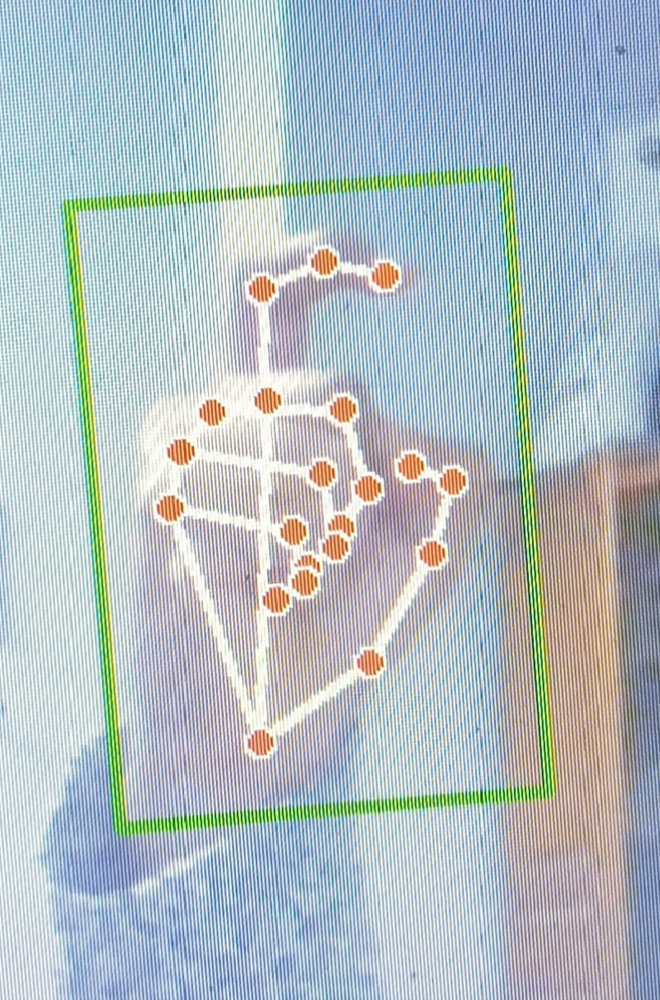
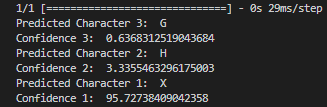
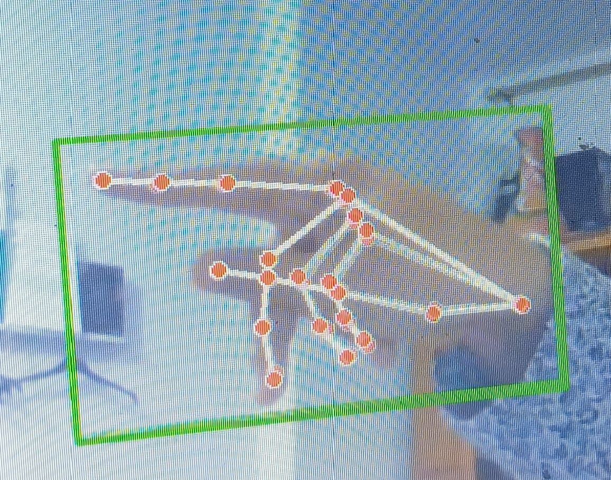
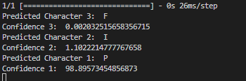

# Sign Language Recognition

This project aims to detect and recognize hand gestures in real-time using computer vision techniques and machine learning models. Specifically, it focuses on recognizing sign language gestures captured through a webcam.

## Overview

Sign Language Recognition is a field of computer vision and machine learning that focuses on interpreting and understanding sign language gestures. It involves developing algorithms and models capable of recognizing and translating hand movements and gestures into corresponding text or spoken language.

This technology plays a crucial role in enabling communication for individuals who are deaf or hard of hearing, as well as facilitating interaction between people who use different sign languages.

Key components of Sign Language Recognition systems include:

1. **Hand Gesture Detection:** Using computer vision techniques to detect and track the movements of hands and fingers in real-time.
2. **Feature Extraction:** Identifying and extracting relevant features from the detected hand gestures, such as hand shape, movement trajectory, and finger positions.
3. **Machine Learning Models:** Training machine learning models, such as deep neural networks, to classify and recognize different sign language gestures based on the extracted features.
   
4. **Next Step - Natural Language Processing:** Translating recognized gestures into text or spoken language, allowing for seamless communication between sign language users and non-signers.

Sign Language Recognition technology has the potential to enhance accessibility and inclusion for individuals with hearing impairments in various domains, including education, employment, and social interactions.

## Images







## Installation

1. Clone this repository to your local machine:

    ```bash
    git clone https://github.com/jarray-najm/Sign_Language_Recognition.git

2. Open the `Model_Sign_Language_MNIST.ipynb` notebook in Google Colab.
3. Execute the notebook to train a new model version if needed.
4. Set up a new project directory on your local machine.
5. Install the required dependencies:

    ```bash
    pip install -r requirements.txt

## Usage

1. After installing the dependencies, run the following command to start the application:

    ```bash
    python CameraHandSign.py

2. Point your webcam towards your hand and perform sign language gestures.
3. Wait for the results to be displayed in the terminal.

## Acknowledgments

1. The deep learning model used in this project is based on the Sign Language MNIST dataset.
2. Hand gesture detection is performed using the Mediapipe library.

## Contact

For inquiries or feedback, feel free to reach out via email or whatsApp:
- Email: najmejarray@gmail.com
- WhatsApp: +21628259497
## License

This project is licensed under the MIT License - see the [LICENSE](LICENSE) file for details.
